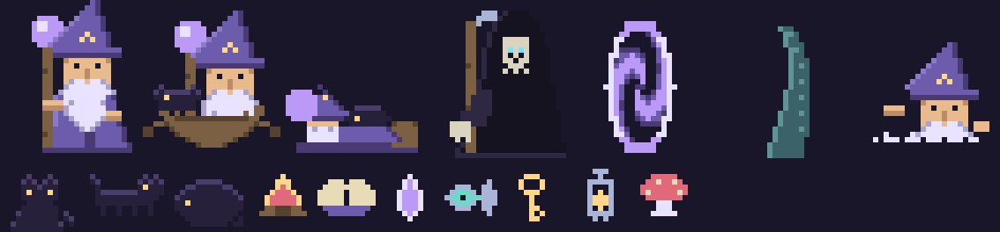

# Omarchy Wizard

A wizard lives on your desktop. He reads your wallpaper, walks its shoreline,
rows across its lake, and lets himself into its castles.



He is **Landis**. The black cat is **Soot**. Death drops in every so often,
because he is fond of the cat.

This is an [Omarchy](https://omarchy.org/) shell plugin — a Quickshell panel
that sits on the Wayland `bottom` layer, above your wallpaper and beneath every
window, so he is part of the desktop scene rather than something in front of
your work.

---

## What "reads your wallpaper" actually means

`scene.py` analyses the current background and reports:

- which stretches of his walking band are **water** and which are **ground**
- a **walkable ground profile** — the terrain he climbs, draped so it has no
  cliffs in it
- **structures** — clusters of lit windows
- **lamps** — individual warm lights
- **crystals** — bright, saturated, *cool* glows down on the bank

This is heuristic scene reading, **not object recognition**. It knows "a tall
cluster of lights at x=3210". It does not know that is a castle, and it never
will. Everything Landis says about a place hedges accordingly — *"A TOWER, OR SO
IT SEEMS."*, *"LIGHTS ON THE HORIZON."*

Every threshold is relative to the wallpaper's own distribution, so nothing is
tuned to one picture. A wallpaper with no shoreline yields no water; one with no
lights yields no structures. It degrades to "he walks along the bottom of the
screen", which is a perfectly good desktop pet.

It works best on illustrative or pixel-art landscapes. It will find very little
in an abstract gradient, and that is the correct answer rather than a failure.

## Requirements

- Omarchy (Quickshell-based shell — `omarchy-shell` must be on `PATH`)
- `python-numpy` and `python-pillow` for the scene analysis

```bash
omarchy pkg add python-numpy python-pillow
```

Without them he simply walks the bottom of the screen: the analysis fails
safely and he carries on.

## Install

```bash
omarchy plugin add https://github.com/USER/omarchy-wizard.git --enable --yes
omarchy restart shell
```

Then summon him:

```bash
omarchy-shell shell toggle chris.wizard '{}'
```

### A keybinding

In `~/.config/hypr/bindings.lua`:

```lua
o.bind("SUPER + ALT + W", "Wizard", "omarchy-shell shell toggle chris.wizard '{}'")
```

### A menu entry

In `~/.config/omarchy/extensions/omarchy-menu.jsonc`:

```jsonc
"system.wizard": {
  "icon": "",
  "label": "Wizard",
  "action": "omarchy-shell shell toggle chris.wizard '{}'",
  "checked": "hyprctl layers -j | grep -q chris-wizard"
}
```

## He is opt-in, properly

He is a `panel` plugin with `keepLoaded: false`. Until you summon him there is
no window, no timer and no layer surface — nothing of him is running. Hiding him
destroys the lot again. Being *enabled* only makes him summonable.

## Controls

| | |
|---|---|
| **Click** | he casts, with a line in a pixel speech bubble |
| **Drag** | pick him up; he falls and lands where you drop him |
| **Middle-click** | he rummages in his pack and uses something |
| **Right-click** | he says goodbye and vanishes |
| **Hover** | he stops and turns to face you, and shows what he is carrying |

## What he does on his own

**Ashore** he walks the terrain, climbs the banks, sleeps in a bedroll with Soot
curled on his chest, conjures a campfire to sit by, touches the crystals, and
sets off to visit anything the analysis found. Structures he enters through an
arcane portal — he is a wizard, so he steps out of the world rather than
scrambling up an invisible hillside — and while he is gone the real windows of
the place he went shimmer, so you can see where he is.

**Afloat** he rows out across the lake, shrinking with distance. A tentacle may
rise alongside. He may stop to fish, or fall in, or watch a fish jump, or notice
something large pass underneath.

**Soot** trails him, sits when she catches up, and about half the time gets in
the boat. She will not cross water on her own — but cats always know where you
are, so if he strands her she turns up on his shore anyway.

**Death** calls every few minutes while Landis is ashore, walks over, and pets
the cat. His speech is set pale-on-dark, since the font is capitals-only and
small caps were not otherwise available.

## Configuration

Options go in the summon payload:

```bash
omarchy-shell shell toggle chris.wizard '{"scale":5,"speed":40,"cat":false}'
```

| key | default | meaning |
|---|---|---|
| `scale` | `4` | device pixels per sprite pixel, up close |
| `speed` | `26` | sprite pixels per second on land |
| `explore` | `true` | may he set off on errands |
| `cat` | `true` | is Soot along |
| `layer` | `"bottom"` | `bottom`, `top` or `overlay` |
| `screen` | focused | output name, e.g. `DP-1` |

`layer: "top"` puts him in front of your windows. He then draws over fullscreen
games too, and his terrain-following only reads correctly against a visible
wallpaper — `bottom` is the recommended setting.

## Poking at it

```bash
omarchy-shell shell call chris.wizard report ""          # full state as JSON
omarchy-shell shell call chris.wizard say "HELLO"        # put words in his mouth
omarchy-shell shell call chris.wizard pack ""            # what he is carrying
omarchy-shell shell call chris.wizard rescan ""          # re-read the wallpaper
omarchy-shell shell call chris.wizard summonDeath ""     # call Death now
omarchy-shell shell call chris.wizard startWaterEvent "" # force a lake event
omarchy-shell shell call chris.wizard startLandEvent ""  # force a shore event
```

`report` is the thing to reach for when something looks wrong — it gives his
mood, position, footing, scale, what the analysis found, and what everyone is
doing. Most misbehaviour shows up there before it shows up on screen.

You can also check what the analysis makes of any image directly:

```bash
python3 scene.py 5120 1440 120 /path/to/wallpaper.png | python3 -m json.tool
```

## The art

Every sprite is generated, not hand-drawn. `tools/wizard.py` composes each frame
from pose parameters and rewrites `Sprites.js`:

```bash
python3 tools/wizard.py             # regenerate Sprites.js
python3 tools/wizard.py --preview   # also write sprite-sheet.png
```

Edit the generator, never `Sprites.js`. Composing frames from shared parts is
what keeps the walk bob, hem sway and staff raise pixel-aligned across poses.

The palette deliberately matches a Tokyo Night wallpaper — deep purples, lamplight
gold — so he looks like he belongs in the scene he is walking through.

## Notes for anyone hacking on it

A few things that cost me time and are not obvious:

- **Plugin edits do not always hot-reload.** If a change appears to do nothing,
  `omarchy restart shell` before suspecting your code. It refuses while the
  session is locked, so don't redirect its output to `/dev/null`.
- **Sprites are positioned by their content bottom, not their grid bottom.**
  Every pose shares one grid; a pose that does not reach the bottom of it leaves
  a gap that reads as hovering. `FRAME_PAD` carries the offset.
- **`afloat` is a mood; `overWater` is a place.** Never use the first to mean
  the second, or he lights campfires on the lake.
- **Size is continuous and eased.** Discrete scale tiers were tried first and
  popped badly. Fractional scale stays crisp because `PixelGrid` snaps each
  sprite pixel's *edges* rather than its size.
- **Every direction change goes through `turnAround()`**, which enforces a floor
  between flips. Without it any condition that reverses him each tick turns him
  into a stuck, 30Hz blur.

## Licence

MIT — see [LICENSE](LICENSE).

Death, and his fondness for cats, are a fond nod to Terry Pratchett's Discworld.
