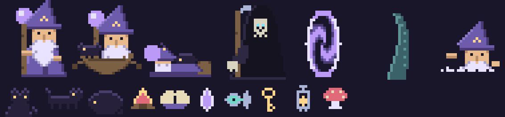

# Omarchy Wizard

A wizard lives on your desktop. He reads your wallpaper, walks its shoreline,
rows across its lake, and lets himself into its castles.



He is **Landis**. The black cat is **Soot**. Death drops in every so often,
because he is fond of the cat.

This is an [Omarchy](https://omarchy.org/) shell plugin — a Quickshell panel
that sits on the Wayland `bottom` layer, above your wallpaper and beneath every
window, so he is part of the desktop scene rather than something in front of
your work.

---

## What "reads your wallpaper" actually means

`scene.py` analyses the current background and reports:

- which stretches of his walking band are **water** and which are **ground**
- a **walkable ground profile** — the terrain he climbs, draped so it has no
  cliffs in it
- **structures** — clusters of lit windows
- **lamps** — individual warm lights
- **crystals** — bright, saturated, *cool* glows down on the bank

This is heuristic scene reading, **not object recognition**. It knows "a tall
cluster of lights at x=3210". It does not know that is a castle, and it never
will. Everything Landis says about a place hedges accordingly — *"A TOWER, OR SO
IT SEEMS."*, *"LIGHTS ON THE HORIZON."*

Every threshold is relative to the wallpaper's own distribution, so nothing is
tuned to one picture. A wallpaper with no shoreline yields no water; one with no
lights yields no structures. It degrades to "he walks along the bottom of the
screen", which is a perfectly good desktop pet.

It works best on illustrative or pixel-art landscapes. It will find very little
in an abstract gradient, and that is the correct answer rather than a failure.

## Requirements

- Omarchy (Quickshell-based shell — `omarchy-shell` must be on `PATH`)
- `python-numpy` and `python-pillow` for the scene analysis

```bash
omarchy pkg add python-numpy python-pillow
```

Without them he simply walks the bottom of the screen: the analysis fails
safely and he carries on.

### Optional: a voice of his own

If [Ollama](https://ollama.com/) is running on this machine, he stops reading
his lines off a list and starts writing them. See
[He can think, if you let him](#he-can-think-if-you-let-him). Without it he
speaks exactly as he always did.

```bash
omarchy pkg add ollama-cuda   # or plain `ollama` with no nvidia card
sudo systemctl enable --now ollama
ollama pull llama3.2:3b
```

## Install

```bash
omarchy plugin add https://github.com/cafarnfield/omarchy-wizard.git --enable --yes
omarchy restart shell
```

Then summon him:

```bash
omarchy-shell shell toggle landis.wizard '{}'
```

### A keybinding

In `~/.config/hypr/bindings.lua`:

```lua
o.bind("SUPER + ALT + W", "Wizard", "omarchy-shell shell toggle landis.wizard '{}'")
```

### A menu entry

In `~/.config/omarchy/extensions/omarchy-menu.jsonc`:

```jsonc
"system.wizard": {
  "icon": "",
  "label": "Wizard",
  "action": "omarchy-shell shell toggle landis.wizard '{}'",
  "checked": "hyprctl layers -j | grep -q landis-wizard"
}
```

## He is opt-in, properly

He is a `panel` plugin with `keepLoaded: false`. Until you summon him there is
no window, no timer and no layer surface — nothing of him is running. Hiding him
destroys the lot again. Being *enabled* only makes him summonable.

## Controls

| | |
|---|---|
| **Click** | he casts, with a line in a pixel speech bubble |
| **Drag** | pick him up; he falls and lands where you drop him |
| **Middle-click** | he rummages in his pack and uses something |
| **Right-click** | he says goodbye and vanishes |
| **Hover** | he stops and turns to face you, and shows what he is carrying |

## What he does on his own

**Ashore** he walks the terrain, climbs the banks, sleeps in a bedroll with Soot
curled on his chest, conjures a campfire to sit by, touches the crystals, and
sets off to visit anything the analysis found. Structures he enters through an
arcane portal — he is a wizard, so he steps out of the world rather than
scrambling up an invisible hillside — and while he is gone the real windows of
the place he went shimmer, so you can see where he is.

**Afloat** he rows out across the lake, shrinking with distance. A tentacle may
rise alongside. He may stop to fish, or fall in, or watch a fish jump, or notice
something large pass underneath.

**Soot** trails him, sits when she catches up, and about half the time gets in
the boat. She will not cross water on her own — but cats always know where you
are, so if he strands her she turns up on his shore anyway.

**Death** calls every few minutes while Landis is ashore, walks over, and pets
the cat. His speech is set pale-on-dark, since the font is capitals-only and
small caps were not otherwise available.

## He can think, and nothing else speaks for him

**He needs a model. Without one he does not talk at all.**

There is no script left. `Brain.js` used to hold two hundred-odd fixed remarks
picked at random; every one of them is gone, and what survives of that file is
two functions of arithmetic. Each of his thirty-four beats — touching a crystal,
landing a fish, being picked up by the scruff, finding his pack empty, Soot
making off with his lantern — is written on the spot by the model, for the
moment he is actually in.

He is told where he is standing, what the wallpaper analysis found, what is in
his pack, whether Soot is beside him or has been turned into a duck — and, if
you leave `sense` on, what the machine under him is doing. So he grumbles about
*your* uptime and *your* disk, not a generic one.

None of it leaves the machine. It is loopback HTTP to Ollama and nothing else:
no account, no API key, nothing on disk to leak.

**There is no floor under him any more.** With no daemon, or the model not
pulled, he walks the shore, rows the lake, fishes, sleeps and lets himself into
castles exactly as before, in complete silence. That is the trade for having
nothing canned. `oracle ""` and the chat box header will tell you why he has
gone quiet.

A line arriving more than seven seconds after its moment is dropped rather than
spoken, since by then it is a remark about something he has stopped doing. He
would rather say nothing than say it late.

### Talking to him

```bash
omarchy-shell shell call landis.wizard chat ""
```

That opens the chat box: a panel in the corner holding everything anyone has
said this summoning, with somewhere to type back. He answers in his bubble as
before, and the same words stay in the panel to be read at leisure.

The bubble is right for `MIND THE CABLES.` and quite wrong for an answer to a
real question -- five lines of 5x7 capitals on a three-second timer, gone
before you have finished reading. That is what the panel is for.

| | |
|---|---|
| **Type and press Return** | ask him something |
| **Escape**, or the `×` | close it; he stays where he is |
| **Scroll up** | it stops following the bottom until you scroll back down |

Colour-coded by who is talking: purple for Landis, gold for you, and pale bone
for Death. His own line is timestamped when he says it, so you can tell an
answer from the remark he happened to make while you were reading.

A keybinding worth having:

```lua
o.bind("SUPER + ALT + A", "Ask the wizard",
  [[bash -c 'hyprctl layers -j | grep -q landis-wizard || omarchy-shell shell toggle landis.wizard "{}"; omarchy-shell shell call landis.wizard chat open']])
```

It summons him first if he is not out, since there is nothing to chat to
otherwise. A Lua long string (`[[ ]]`) keeps the nested quoting readable.

You can still ask him a single question without the panel, and he will still
answer in the bubble:

```bash
omarchy-shell shell call landis.wizard ask "WHERE DOES SOOT GO"
```

He remembers the last four exchanges either way, so you can follow a thread;
`forget` clears it.

The chat box is a second layer surface, on `top` and accepting keyboard focus
on demand -- both of which the wizard's own surface must never do, since he
lives on `bottom` and is meant to be part of the wallpaper. Focus is
`OnDemand`, not `Exclusive`: click it to type, and it never holds your keyboard
while it sits there.

### The pause before he speaks

A click has to answer instantly and a local model does not, so ambient remarks
are fetched several at a time in the background and kept in a small pool; a
click spends one of them with no wait at all.

Every other beat is asked for as it happens, so there is a second or so between
the thing occurring and him remarking on it. That is not a bug and not worth
engineering away — a wizard who pauses before commenting is a wizard
considering it.

He is held to one considered thought every two seconds, so a busy minute on the
shoreline does not become a minute of continuous inference.

### Death speaks for himself

Death has his own prompt, his own process and his own voice: an old
professional with a list, unfailingly polite, here entirely because he is fond
of the cat. Given Landis's prompt he grumbled about browser tabs, which is
nobody's idea of Death.

### The register examples are not lines

`oracle.py` shows the model ten short lines as an example of the voice. They
are never spoken, and it is told in as many words not to reuse them. They exist
because a 3b model with no examples writes stage directions — *LAMP CASTS
FLICKERING DIM EVENING LIGHT.* — rather than remarks.

Scene detail is filtered per beat for the same reason. Told about three lit
towers, he answered a question about bedtime with *THREE LIGHTS, ONE TOWER
STANDING TALL.* He is now told only what the beat at hand needs.

### He is not a monitoring tool

Everything he says is written having been shown real figures, and can therefore
look like a measurement. **None of it is a measurement.**
A 3b model quotes a number correctly and then draws the opposite conclusion
from it in the same sentence:

> **AM I RUNNING OUT OF MEMORY**
> YES. 12.2 GB USED OF 31.2 GB TOTAL. NOT QUITE USED.

The prompt does what it can -- the facts are labelled as true, every figure
carries its unit and direction, he is told to correct a false premise rather
than agree with it, and to admit he was told nothing about anything not
listed. That stopped him inventing drive letters and GPU temperatures. It did
not make him able to reason about the numbers, and no wording will.

A larger model is markedly better here if you care; `{"model":"qwen2.5:7b"}`
costs a few seconds a reply, which the background pool hides for everything
except questions you ask directly. But the honest position is that he is
flavour. Run `df -h` like everyone else.

### What he is told about your machine

With `sense` on (the default) he is told the time and day, uptime, CPU load,
memory and disk pressure, battery if there is one, how many windows are open,
and the **class** of the focused window — `firefox`, `Alacritty`.

Deliberately not window *titles*. Titles carry document names, ticket numbers
and client names, and none of that needs to be in a prompt for a joke about a
cat. Turn the lot off with `sense: false`.

See exactly what he would be told, with no model involved:

```bash
python3 oracle.py sense | python3 -m json.tool
```

### Choosing a model

`llama3.2:3b` is the default because it is small, quick, and quite funny when
told to be terse. Anything you have pulled will work; a larger model is wittier
and slower, and since he speaks in one-line asides the trade is rarely worth
it. Reasoning models are asked not to think, since spending a thousand tokens
of chain-of-thought on `MIND THE CABLES.` is a poor use of a graphics card.

```bash
omarchy-shell shell toggle landis.wizard '{"model":"qwen2.5:7b"}'
```

## Configuration

Options go in the summon payload:

```bash
omarchy-shell shell toggle landis.wizard '{"scale":5,"speed":40,"cat":false}'
```

| key | default | meaning |
|---|---|---|
| `scale` | `4` | device pixels per sprite pixel, up close |
| `speed` | `26` | sprite pixels per second on land |
| `explore` | `true` | may he set off on errands |
| `cat` | `true` | is Soot along |
| `layer` | `"bottom"` | `bottom`, `top` or `overlay` |
| `screen` | focused | output name, e.g. `DP-1` |
| `ai` | `true` | may he borrow a voice from a local model |
| `model` | `"llama3.2:3b"` | which Ollama model to borrow it from |
| `aiHost` | `"127.0.0.1:11434"` | where the Ollama daemon is |
| `sense` | `true` | may he notice load, disk, battery, open windows |

`layer: "top"` puts him in front of your windows. He then draws over fullscreen
games too, and his terrain-following only reads correctly against a visible
wallpaper — `bottom` is the recommended setting.

## Poking at it

```bash
omarchy-shell shell call landis.wizard report ""          # full state as JSON
omarchy-shell shell call landis.wizard say "HELLO"        # put words in his mouth
omarchy-shell shell call landis.wizard pack ""            # what he is carrying
omarchy-shell shell call landis.wizard rescan ""          # re-read the wallpaper
omarchy-shell shell call landis.wizard summonDeath ""     # call Death now
omarchy-shell shell call landis.wizard startWaterEvent "" # force a lake event
omarchy-shell shell call landis.wizard startLandEvent ""  # force a shore event
omarchy-shell shell call landis.wizard ask "WHY THE HAT"  # put a question to him
omarchy-shell shell call landis.wizard oracle ""          # is he thinking, and with what
omarchy-shell shell call landis.wizard forget ""          # drop the conversation so far
omarchy-shell shell call landis.wizard chat ""            # toggle the chat box (or: open / close)
omarchy-shell shell call landis.wizard transcript ""      # everything said this summoning, as text
```

`oracle` is the first thing to check when he is speaking off the list and you
expected better. It reports whether the daemon answered, which model it found,
how many lines are in the pool, and — when it is not working — why not:

```json
{"active":true,"status":"unavailable","ready":false,"model":"llama3.2:3b",
 "detail":"model llama3.2:3b not pulled (have: qwen2.5:7b)"}
```

The analysis half can be checked the same way, without a model:

```bash
python3 oracle.py ambient --count 3     # three things he might say right now
python3 oracle.py ask --ctx '{"question":"WHO ARE YOU"}'
```

`report` is the thing to reach for when something looks wrong — it gives his
mood, position, footing, scale, what the analysis found, and what everyone is
doing. Most misbehaviour shows up there before it shows up on screen.

You can also check what the analysis makes of any image directly:

```bash
python3 scene.py 5120 1440 120 /path/to/wallpaper.png | python3 -m json.tool
```

## The art

Every sprite is generated, not hand-drawn. `tools/wizard.py` composes each frame
from pose parameters and rewrites `Sprites.js`:

```bash
python3 tools/wizard.py             # regenerate Sprites.js
python3 tools/wizard.py --preview   # also write sprite-sheet.png
```

Edit the generator, never `Sprites.js`. Composing frames from shared parts is
what keeps the walk bob, hem sway and staff raise pixel-aligned across poses.

The palette deliberately matches a Tokyo Night wallpaper — deep purples, lamplight
gold — so he looks like he belongs in the scene he is walking through.

## Notes for anyone hacking on it

A few things that cost me time and are not obvious:

- **Plugin edits do not always hot-reload.** If a change appears to do nothing,
  `omarchy restart shell` before suspecting your code. It refuses while the
  session is locked, so don't redirect its output to `/dev/null`.
- **Sprites are positioned by their content bottom, not their grid bottom.**
  Every pose shares one grid; a pose that does not reach the bottom of it leaves
  a gap that reads as hovering. `FRAME_PAD` carries the offset.
- **`afloat` is a mood; `overWater` is a place.** Never use the first to mean
  the second, or he lights campfires on the lake.
- **Size is continuous and eased.** Discrete scale tiers were tried first and
  popped badly. Fractional scale stays crisp because `PixelGrid` snaps each
  sprite pixel's *edges* rather than its size.
- **The static lists are the floor, not the fallback.** Anything that adds a
  new thing for him to say should add it to `Brain.js` first and call `voice()`
  with it. A beat that only exists in the model is a beat that vanishes when
  Ollama is not running.
- **A generated line is stale the moment he moves on.** `voice()` records the
  bubble's stamp; `speakGenerated()` refuses to speak an answer whose stamp no
  longer matches. Without that he answers questions nobody can remember asking.
- **`exited` and `streamFinished` have no promised order.** Read the text in
  the stream handler and the exit code in `onExited`, and never let one depend
  on the other having run.
- **Every direction change goes through `turnAround()`**, which enforces a floor
  between flips. Without it any condition that reverses him each tick turns him
  into a stuck, 30Hz blur.

## Licence

MIT — see [LICENSE](LICENSE).

Death, and his fondness for cats, are a fond nod to Terry Pratchett's Discworld.
